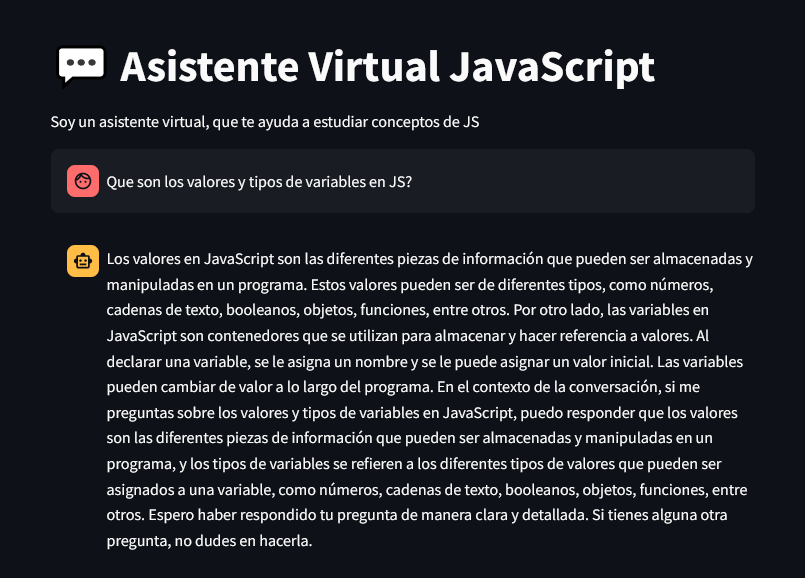
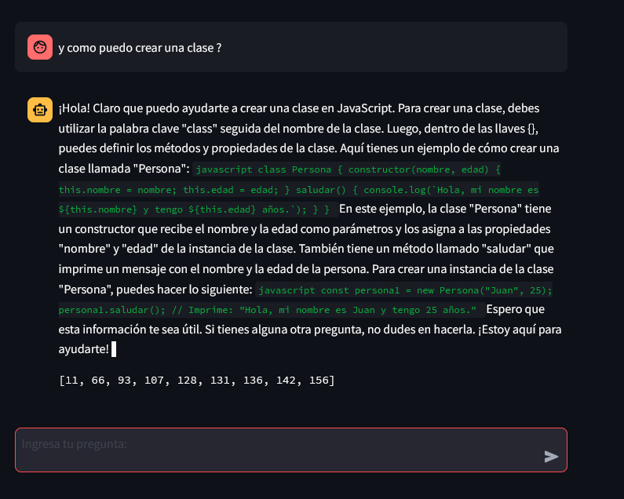

# Chatbot-JS

## Objetivo: Crear un asistente virtual personalizado, que permita facilitar el estudio del lenguaje de programación JS

# Capturas:

* Interfaz del asistente

# Características Claves:

* Fuente de información: Se utilizo un libro en formato pdf de la documentación de JavaScript. El autor es Marijn Haverbeje y el libro es "Eloquent Javascript" tercera edición.

* Tecnologías:

* Limitaciones

# Tecnologías Utilizadas

Las librerías utilizadas son:

* OpenAI (Embeddings y Gpt3.5-turbo-16tokens)
* Streamlit (Interfaz de usuario)
* Langchain (Framewokr principal)
* PyPDF (Procesamiento del archivo pdf)
* Virtualenv (Entorno virtual)
* Poetry (Gestión de dependencias)

# Instalación

* Se debe crear un entorno virtual con virtualenv, activarlo y se continua con la instalación de poetry con pip install poetry. Ya una vez instalado poetry se debe instalar las dependencias con poetry, para ello, se escribe en consola poetry install.
* Para correr el proyecto, se debe navegar hasta la carpeta Front y escribir en la consola, con el entorno activado streamlit run main.py